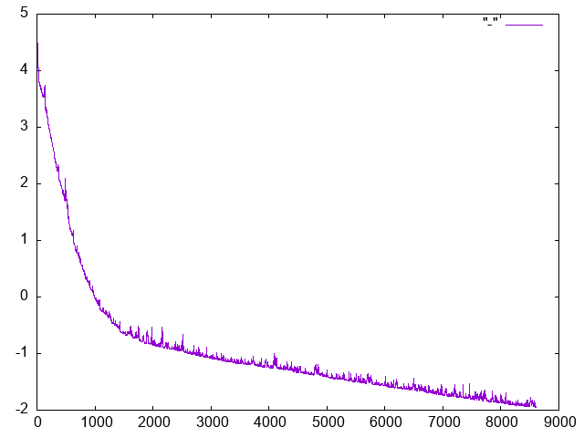

# Regression and Linear Combinations

Code for the blog post Regression and Linear Combinations

Built with Python 3.9

Recreate plot with

```
python quadratic_regression.py > out.csv
awk -F, '{print $1,log($3)}' out.csv | gnuplot -e 'set terminal png; plot "-" with lines' > graph.png
```


